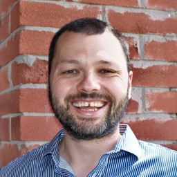
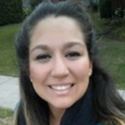

<!-- Ewan -->





## Ewan Dunbar

Ewan is an Assistant Professor of Computational Linguistics at the Department
of French at the University of Toronto. His research focuses on speech.
[Webpage](http://individual.utoronto.ca/ewan_dunbar/).





<!-- Vanida -->





## Vanina Machado

Vanina Sofia Machado is a Ph.D. Candidate at the Spanish and Portuguese
Department, University of Toronto. Her interests focus mainly in
sociolinguistics, languages in contact, second language acquisition, language
variation, and prosody.
[Webpage](https://www.spanport.utoronto.ca/people/directories/graduate-students/vanina-machado)





<!-- Sean -->





## Sean Robertson

Sean is a Ph.D. Candidate at the Department of Computer Science at the
University of Waterloo. He works on Automatic Speech Recognition.
[Webpage](https://www.cs.toronto.edu/~sdrobert)




